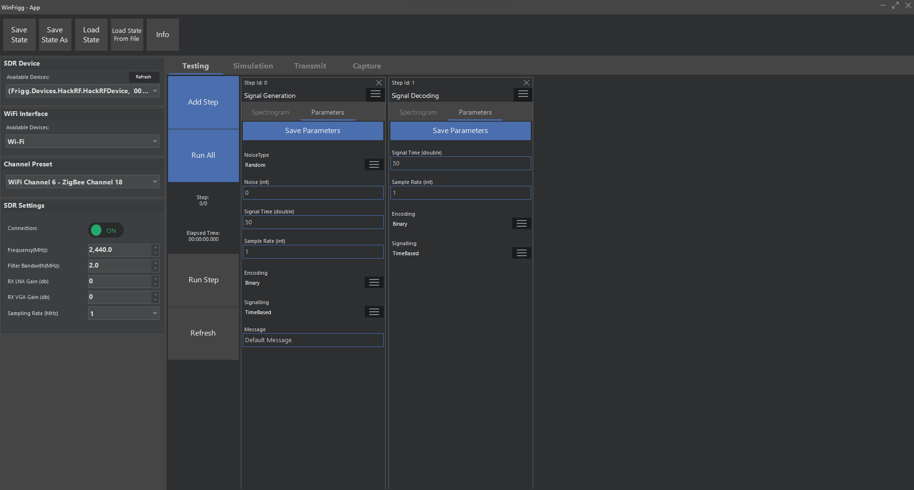
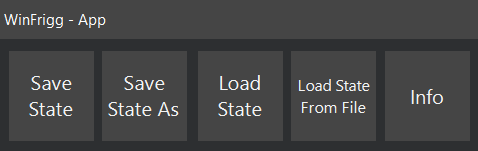
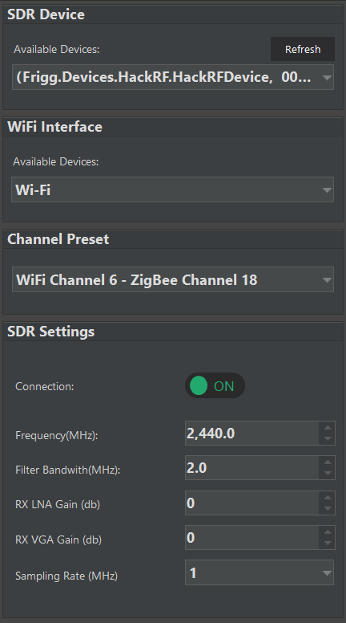
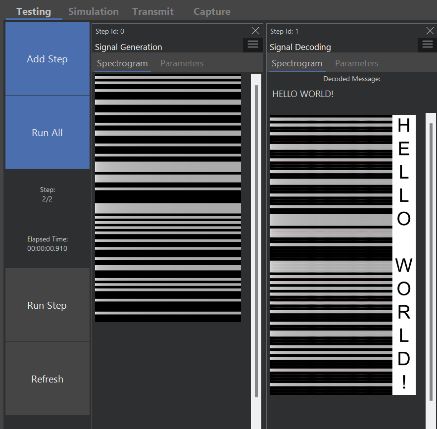
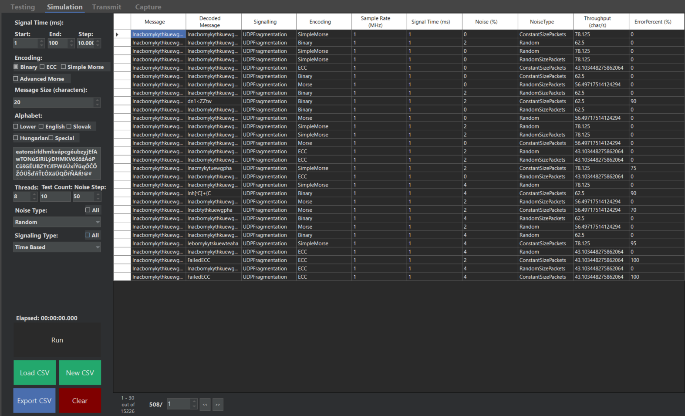
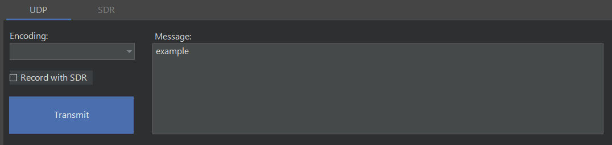
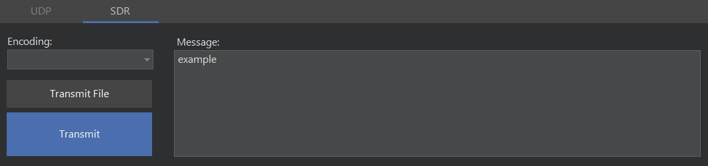
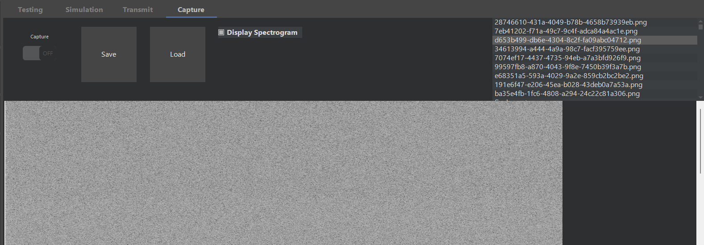
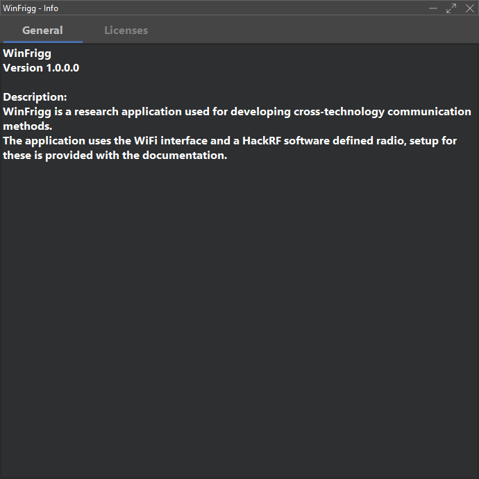

# WinFrigg
 Research Application for Developing Cross-Technology Communication Methods

## Technical Documentation

### Prerequisites for Running the Software

#### System Requirements
- **Operating System**: Windows 10 (64 Bit) or Windows 11

#### Software Requirements
1. **.NET 8**
2. **Python 3.8 (64-bit)**
    - Download from the official Python website.
    - Ensure that Python's installation directory is added to the system's PATH during installation (checkbox during installer).

**Note:**
The application during the first run will install the Python requirements. During this time, the splash screen is visible. This could take up to 5 minutes.

### Building the Software

#### Development Environment
- **Visual Studio 2022**
    - Ensure Visual Studio 2022 is installed with the necessary workloads for .NET desktop development.

#### Build Instructions
1. Open the project solution file (`.sln`) in Visual Studio 2022.
2. Before building the project, perform a "Clean" to remove any existing binary files that may cause conflicts.
3. After cleaning, select "Rebuild" from the Build menu to compile the entire project, ensuring all dependencies are properly resolved.

### Used Packages

#### NuGet Packages (.NET 8)
- **MathNet.Numerics**: Extra math functions.
- **NLog**: Advanced logging.
- **pythonnet**: Hybrid architecture with Python.
- **ReaLTaiizor**: Prettier WinForms controls.
- **Scrutor**: Dependency injection with assembly scanning.
- **SixLabors.ImageSharp**: Work with images (zooming, flipping, etc.).
- **STH1123.ReedSolomon**: Reed Solomon for ECC encoding.
- **Newtonsoft.Json**: Better JSON serializer.

#### Python Packages
- **numpy**: Support and functions for large, multi-dimensional arrays.
- **matplotlib**: Plotting library.
- **pillow**: Python Imaging Library.
- **scipy**: Scientific and technical computing.

### Further Development

#### Implementing Further Logic
To implement further protocols, create a new implementation of the `CTCStep` abstract class in the `Frigg.CTC` class library project. 

By implementing the abstract function `DoStep`, you can manipulate the inputted data and output amplitudes or messages based on your needs. The `DrawSpectrogram` function is also labeled as virtual to enable overriding in cases where the default spectrogram image is not adequate. For an example, see the `DecodingCTCStep`.

### Design of Research Application

The following section explains the user interface and code design aspects of the components of the application.

#### Splash Screen
When starting up the application, it first displays the application's logo as a splash screen. This screen is needed to set up the application, such as on first run when installing the Python dependencies.

#### Main Application Window

After the initial setup is done, the main application window is displayed. This window encompasses all functions available to the user and is made up of a top bar, side bar, and tab page control.

#### Top Bar

The top bar comprises five buttons. The first four let us save the current state of the application (steps in the testing page) to either the default save file or a file of our choosing and also let us load from these files. The last button displays the info page that describes our application and includes all licenses for our application.

#### Side Bar

The side bar contains the setup for the hardware devices, such as selecting the WiFi interface, selecting the SDR device, and setting the frequency and other parameters for the software-defined radio. Due to limitations of the HackRF library, re-connection is not always possible and may require the SDR to be restarted and reconnected.

#### Testing Tab

This tab is the first and default tab open when starting up our application. This tab lets us add up to 10 CTC steps, set their retrospective parameters using a dynamically generated options tab, display the outputted spectrograms, and when applicable, the decoded message. The states of these steps can be saved using the top bar, and the last save is loaded whenever the application is started up.

#### Simulation Tab

The second tab of our main tab control, the simulation page is integral to generating the results found in later sections. The tab has a side bar enabling us to set what types of signaling, encoding, and noise types should be tested and set ranges for all input parameters. We can also set what alphabet should be used for generating the test data. The alphabet's letters are ordered based on their frequency in their respective languages (Zipf's law). We can also view the outputted results in the table on the right. This table is buffered from the generated CSV file, which we can save elsewhere.

#### Transmit Tab
The transmit tab has two sub-tabs:

- **UDP Transmission**: Using WiFi, we transmit UDP fragmentation-based CTC.

- **SDR Transmission**: Transmit simply using the SDR or transmit a previous recording for testing.

#### Capture Tab

The last tab of the main tab control, the capture tab lets us record data from the software-defined radio and display the spectrogram for the given recording. We can also view historical spectrograms on this tab.

#### Info Screen
Displayed by the button in the top bar, the info screen provides basic information about the application and includes all the licenses needed to redistribute with our program.

### Installation and Guide

Please see the video guide for installation and usage steps, which can be found in the Attachments folder. [Watch the guide](Attachments/guide.mp4)
